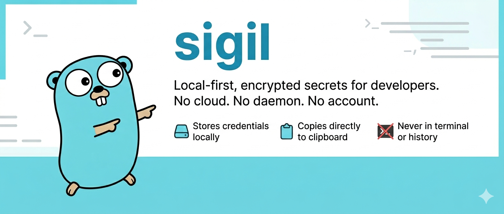

# sigil



Local-first, encrypted secrets for developers. No cloud. No daemon. No account.

Store credentials locally and copy them directly to your clipboard — without touching a `.env` file, exposing values in your terminal, or polluting your shell history.

## Why

`.env` files get committed. Password managers break your flow. Cloud secret managers are overkill for local development.

`sigil` stores your secrets encrypted on disk. When you need a value, it goes straight to your clipboard and clears itself automatically. Nothing is ever printed to the terminal or written to shell history.

## Install

### Go

```bash
go install github.com/matteo-gildone/sigil/cmd/sigil@latest
```

### Download

Grab a binary from the [releases page](https://github.com/matteo-gildone/sigil/releases).

## Usage

### Store a secret

```bash
sigil set KEY
sigil set DB_URL
sigil set STRIPE_KEY
```

You will be prompted for your passphrase and then the secret value. Neither is passed as a command-line argument or written to shell history.

### Copy a secret to clipboard

```bash
sigil get KEY
sigil get DB_URL
```

The value is copied to your clipboard and cleared after 15 seconds by default.

```bash
# change the clear timeout
sigil get -clear 45 KEY

# disable auto-clear
sigil get -clear 0 KEY

# use a specific clipboard tool
sigil get -clip wl-copy KEY
```

The value is never printed to the terminal.

### List all keys

```bash
sigil list
```

### Delete a secret

```bash
sigil delete KEY
```

### Projects

Secrets are namespaced by project. The default project is `default`.

```bash
sigil set -project myapp DB_URL
sigil get -project myapp DB_URL
sigil list -project myapp
sigil delete -project myapp DB_URL
```

## Clipboard

To use a different clipboard tool set the `SIGIL_CLIPBOARD` environment variable:

```bash
# Linux X11
export SIGIL_CLIPBOARD="xclip -selection clipboard"

# Linux Wayland
export SIGIL_CLIPBOARD="wl-copy"

# Windows
export SIGIL_CLIPBOARD="clip"
```

Add this to your shell profile (`~/.zshrc`, `~/.bashrc`) to make it permanent. You can also override it per invocation with the `-clip` flag.

## How it works

Secrets are stored in `~/.local/share/sigil/<project>/store.enc` (XDG-compliant). Each store is a single file encrypted with AES-256-GCM, keyed from your passphrase via PBKDF2-SHA256 with 260,000 iterations. The file on disk is never readable as plain text.

When you run `sigil get`, the value is decrypted in memory and passed directly to your clipboard tool. It is never written to disk or printed to stdout.

## Security

**What sigil protects against**
- Secrets in shell history — values are always prompted interactively, never passed as arguments
- Secrets in your terminal scrollback — values are never printed to stdout
- Unauthorised file access — the store file is encrypted at rest and readable only by the owner (`0600`)

**Known limitations**
- The clipboard is readable by any process on your machine. The auto-clear timeout reduces the window but does not eliminate it
- The passphrase is held in memory as a byte slice for the duration of the operation and zeroed afterward. Go's garbage collector does not guarantee immediate collection, so the window where it is recoverable from memory cannot be fully eliminated
- The store file is protected by your passphrase. A weak passphrase is vulnerable to offline brute-force attack. PBKDF2 at 260,000 iterations makes this slow but not impossible

**Encryption**
- Algorithm: AES-256-GCM (authenticated encryption)
- Key derivation: PBKDF2-SHA256, 260,000 iterations, 16-byte random salt per operation

## Requirements

- Go 1.24+
- A clipboard tool (`pbcopy` on macOS, `xclip` or `wl-copy` on Linux, `clip` on Windows)

## License

MIT
